# 功能

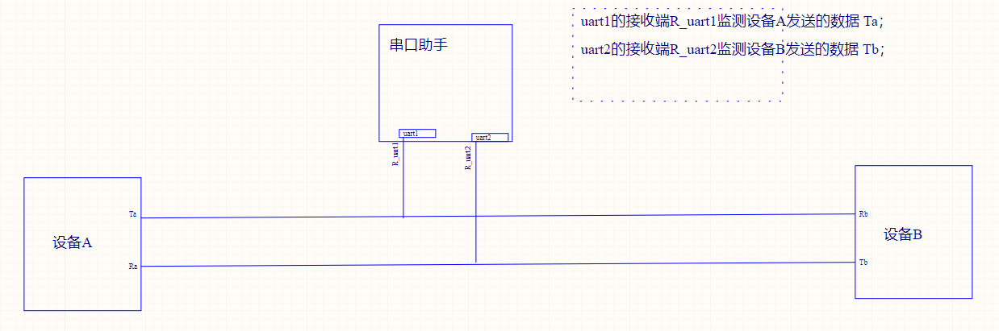

## 采集数据

采集A,B两设备串口通讯的消息（支持TTL，485，232通信）

### 模式1

在屏幕上显示采集到的数据

显示形式：字符形式（只显示ascii中字符）、HEX

显示满后清屏从头开始显示

### 模式2

通过type-C数据线，将采集到的数据发送到PC

发送给电脑的波特率可调，可自定义波特率

### 模式3

将采集到的数据存储在TF卡中，以txt文本格式存储

可以查看TF卡总容量，和空闲容量

## IAP

通过IAP更新程序，方便对产品的固件程序进行升级。

按住K1，再按复位，进入升级模式，通过串口发送app程序的bin文件

## 串口配置

接收数据波特率可调，4800、9600、38400、115200、自定义波特率，最大速率为2Mbps

可以修改串口的数据位停止位校验位

# 使用

3.7v锂电池或Type-C供电

屏幕下方显示按键功能

若A，B设备使用485或232通信，应将TF卡槽旁对应的跳线帽置为1，使对应芯片工作；使用TTL串口通信时将跳线帽悬空

## 接线

A、B两设备通信

设备A的TX——串口助手的TTL_1，设备B的RX——串口助手的TTL_1

设备A的RX——串口助手的TTL_2，设备B的TX——串口助手的TTL_2

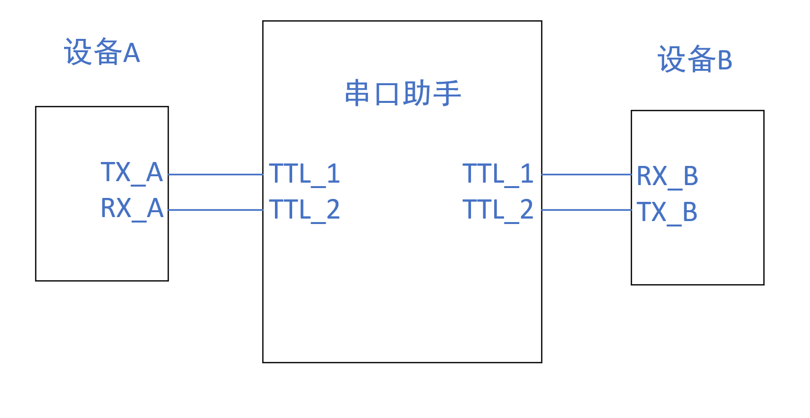

## 流程

#### 1）上电

默认为模式1，屏幕显示数据，K1打开菜单

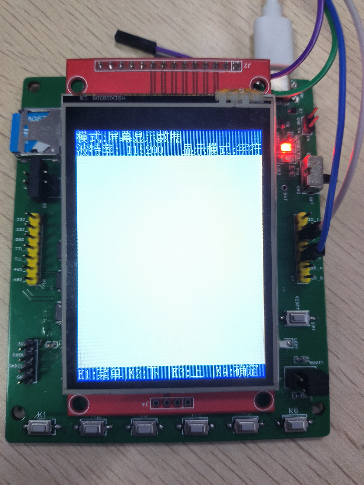

#### 2）功能模式选择

K1返回，K2，K3移动光标，K4确认选择

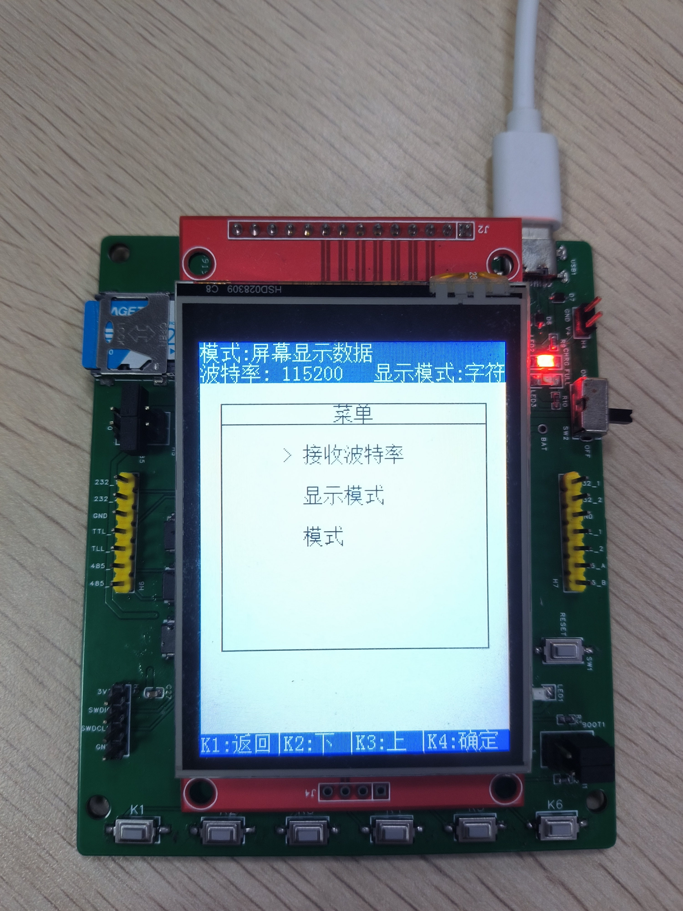

2.1）修改接收波特率，K1返回，K2，K3移动光标，K4确认选择

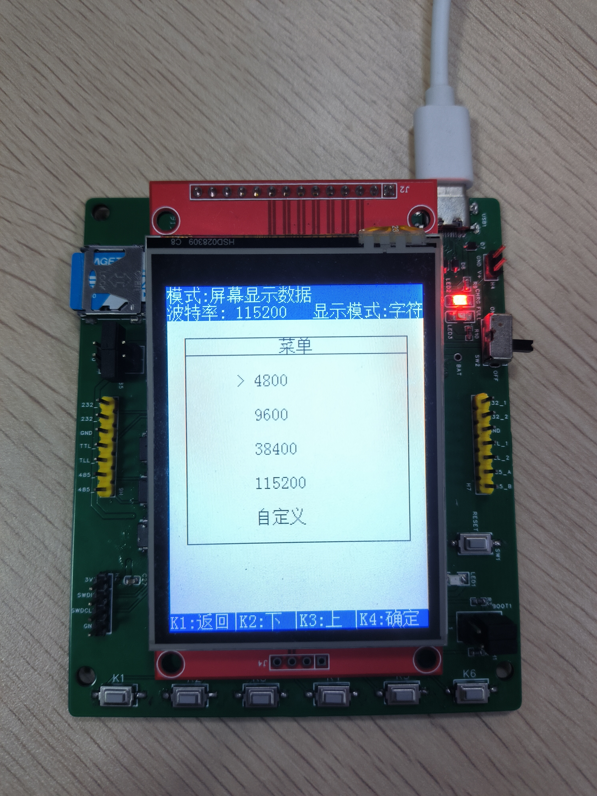

2.1.1）自定义波特率，K1返回（修改波特率，若波特率大于2Mbps，或为0，提示波特率错误），K2改变修改的位次，K3选择的位次+1，K3选择的位次-1

高亮位次的就是要修改的

这里波特率是3.5Mbps显示错误

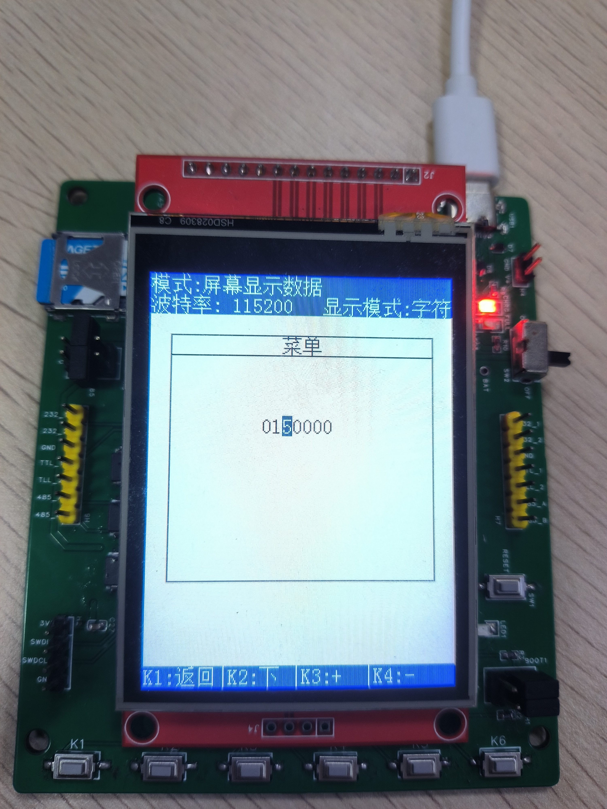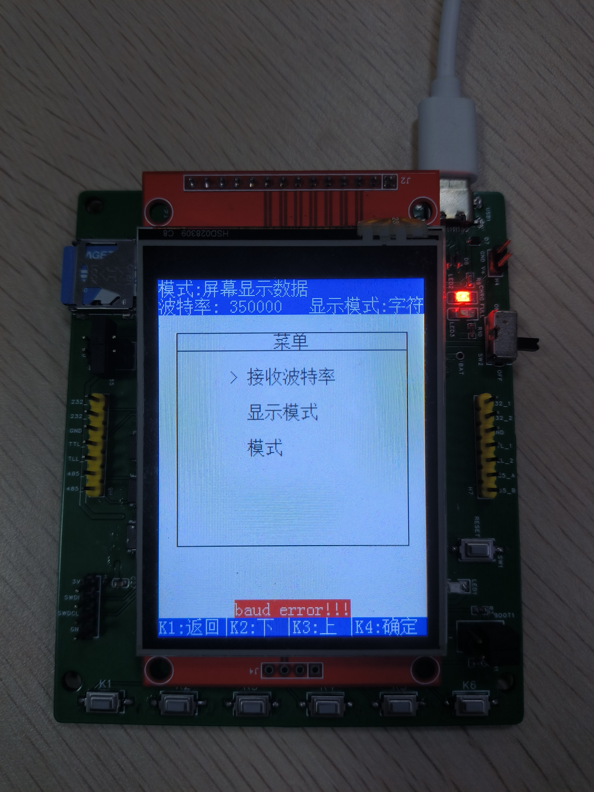

2.2）修改显示模式，字符显示，和十六进制显示

若为字符显示，发送中文，则不显示

2.3）模式选择，1、屏幕显示数据，2、转发数据给PC，3、存储到TF卡上

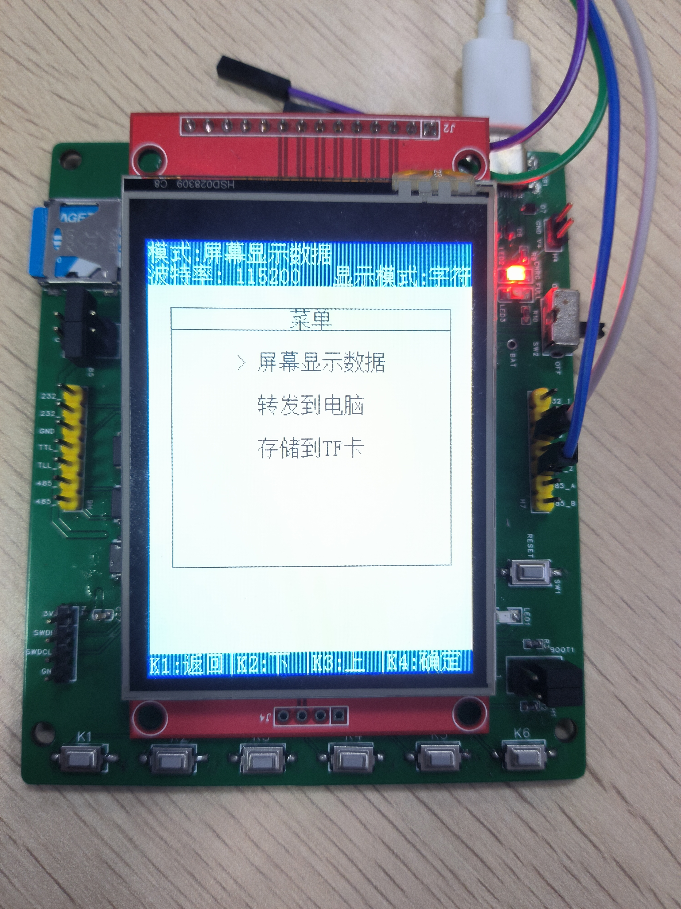

2.3.2）选择发送给电脑的波特率，参考2.1）

#### 3）退出菜单，开始接收数据

3.1）屏幕显示数据（字符显示和Hex显示），前面[1>>]:区分，是设备1发送的还是2发送的

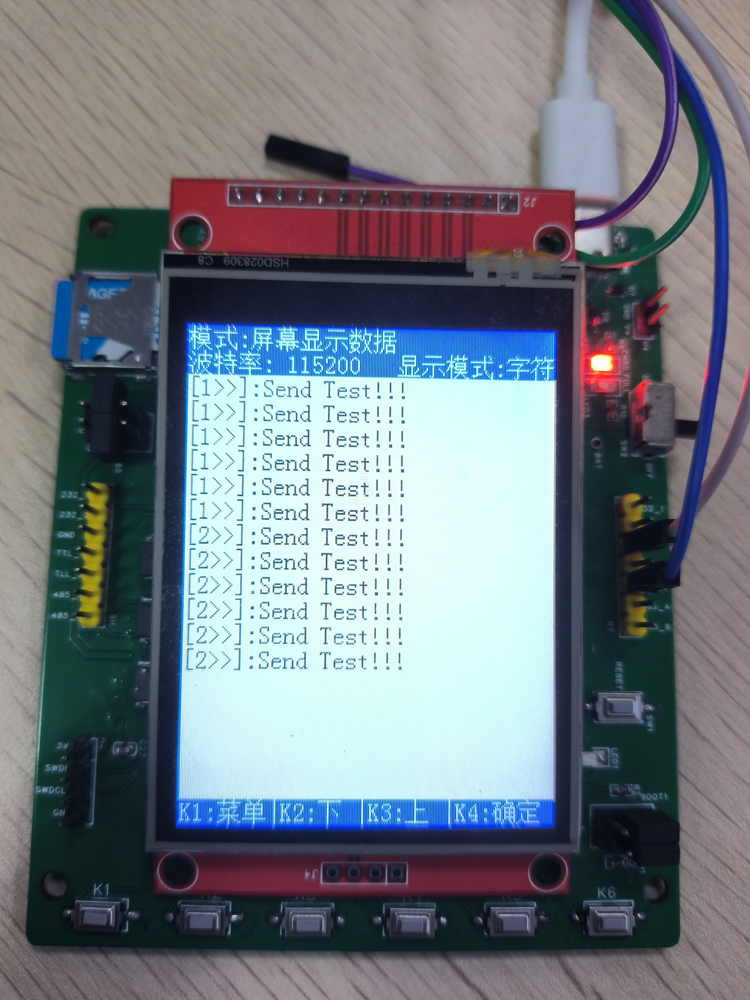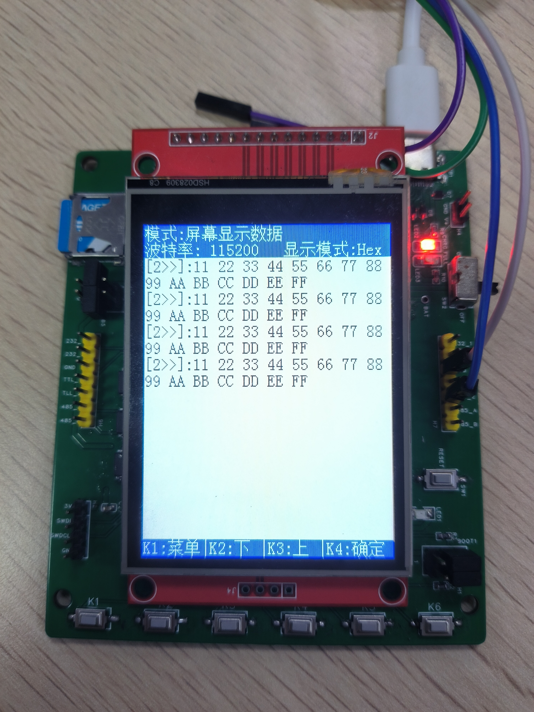

3.2)转发数据给电脑，支持中文发送

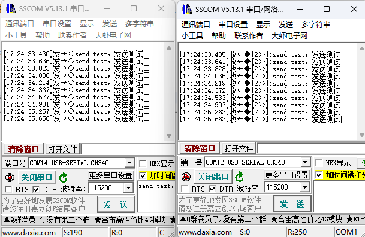

3.3）TF卡存储，支持中文发送，存储到usart_data.txt文件里

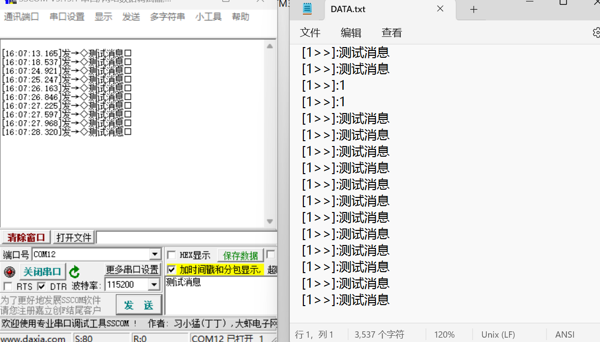

